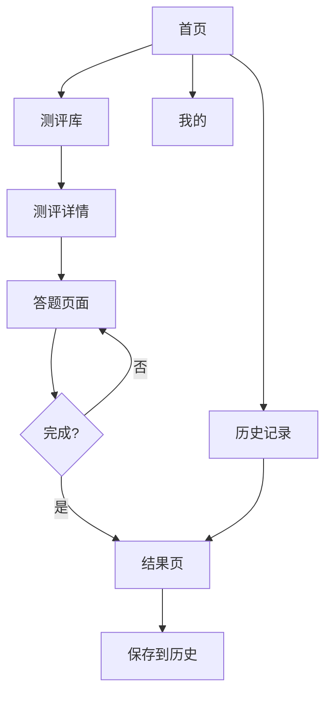

# 心镜 MindMirror 微信小程序 - 产品需求文档 (PRD)

## 1. 产品概述

心镜 MindMirror 微信小程序是一个专业的心理测评与个人成长平台。
- **主要功能**：40+ 专业心理测评、测评答题、结果展示、测评历史、个人中心
- **目标用户**：需要了解自己、探索内心世界的个人用户
- **核心价值**：用科学的心理测评帮助用户了解自己，促进个人成长

**免费版限定**：
- 仅使用微信小程序原生能力
- 无云开发付费功能
- 数据本地存储（wx.setStorage）
- 纯前端，无后端服务

---

## 2. 核心功能

### 2.1 核心页面模块
| 页面 | 核心功能 |
|------|----------|
| 首页 | 精选测评推荐、专题入口、开始测评引导 |
| 测评库 | 测评分类浏览、搜索、筛选、测评卡片 |
| 测评详情 | 测评介绍、题数、时长、开始测评 |
| 答题页面 | 逐题作答、进度显示、上一题/下一题 |
| 结果页 | 结果展示、维度分析、结果描述、分享 |
| 历史记录 | 已完成测评列表、查看历史结果 |
| 我的 | 个人信息、设置、关于 |

### 2.2 页面详细功能

#### 首页 (pages/index/index)
| 模块 | 功能描述 |
|------|----------|
| 顶部欢迎 | 用户昵称、已完成测评数统计 |
| 引导卡片 | 一键开始探索、引导用户进入测评 |
| 精选测评 | 展示 6-8 个推荐测评卡片 |
| 专题入口 | 职场发展、情绪管理、人际关系等专题 |
| 数据统计 | 40+测评、100%隐私、永久免费 |

#### 测评库 (pages/assessments/assessments)
| 模块 | 功能描述 |
|------|----------|
| 分类标签 | 人格、情绪、职业、价值观、趣味等分类 |
| 搜索栏 | 按测评名称搜索 |
| 测评列表 | 卡片式展示，显示：图标、名称、描述、题数、时长 |
| 筛选排序 | 最新/热门筛选 |

#### 测评详情 (pages/assessment-intro/assessment-intro)
| 模块 | 功能描述 |
|------|----------|
| 测评信息 | 图标、名称、描述、题数、预计时长 |
| 测评介绍 | 详细说明、理论依据 |
| 开始按钮 | 进入答题页面 |

#### 答题页面 (pages/assessment-taking/assessment-taking)
| 模块 | 功能描述 |
|------|----------|
| 进度条 | 当前题数/总题数 |
| 题目展示 | 题干、选项（单选） |
| 导航按钮 | 上一题、下一题 |
| 退出确认 | 退出时提示保存进度 |

#### 结果页 (pages/assessment-result/assessment-result)
| 模块 | 功能描述 |
|------|----------|
| 结果概览 | 综合得分、结果标题、副标题 |
| 维度分析 | 各维度得分柱状图/雷达图 |
| 结果描述 | 详细的文字解释 |
| 再测一次 | 重新测评 |
| 分享 | 分享结果给好友（可选） |

#### 历史记录 (pages/history/history)
| 模块 | 功能描述 |
|------|----------|
| 记录列表 | 已完成测评，按时间倒序 |
| 查看结果 | 点击查看历史结果 |
| 删除记录 | 左滑删除单条记录 |

#### 我的 (pages/mine/mine)
| 模块 | 功能描述 |
|------|----------|
| 用户信息 | 头像、昵称（微信授权） |
| 统计数据 | 已完成测评数 |
| 设置 | 清除所有数据、隐私声明 |
| 关于 | 产品介绍、版本信息 |

---

## 3. 核心流程

---

## 4. 用户界面设计

### 4.1 设计风格
- **主色调**：微信绿 (#07C160) 配合 紫/蓝渐变色 (#8B5CF6, #3B82F6)
- **背景色**：深色主题 (#0F172A) 或浅色主题可选
- **按钮风格**：圆角矩形、渐变填充、点击反馈
- **字体**：微信小程序默认字体
- **布局**：卡片式设计、圆角、留白充足
- **图标**：线性简约图标

### 4.2 页面设计要点
| 页面 | 关键设计 |
|------|----------|
| 首页 | 顶部欢迎区域 + 精选测评网格 + 专题卡片 |
| 测评库 | 顶部搜索 + 分类标签 + 瀑布流卡片 |
| 答题页 | 大字号题目 + 大点击区域选项 + 底部导航 |
| 结果页 | 视觉化图表 + 分段文字描述 + 再测按钮 |
| 历史页 | 列表式布局，带时间、得分预览 |
| 我的页 | 简洁列表，分组清晰 |

### 4.3 底部导航栏
| Tab | 图标 | 页面 |
|-----|------|------|
| 首页 | 🏠 | pages/index/index |
| 测评 | 📝 | pages/assessments/assessments |
| 历史 | 📊 | pages/history/history |
| 我的 | 👤 | pages/mine/mine |
