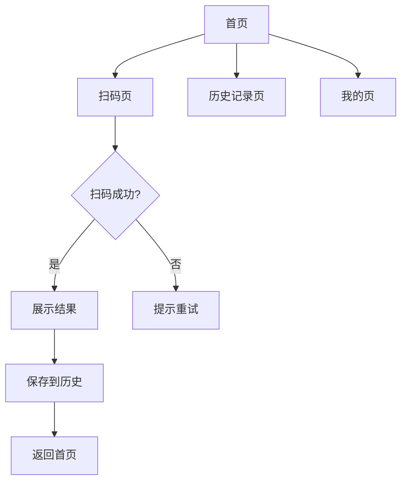

# 扫码仓库微信小程序 - 产品需求文档 (PRD)

## 1. Product Overview
扫码仓库微信小程序是一款专注于扫码识别、记录管理的工具类小程序。
- 主要功能：二维码/条形码扫描、扫码历史记录管理、扫码结果展示
- 目标用户：需要频繁扫码记录的个人用户和企业用户

## 2. Core Features

### 2.1 User Roles
| Role | Registration Method | Core Permissions |
|------|---------------------|------------------|
| 普通用户 | 微信授权登录 | 扫码、查看历史记录、管理个人数据 |

### 2.2 Feature Module
1. **首页**：扫码入口、快速操作、最近记录
2. **扫码页**：实时扫码、手动输入、闪光灯控制
3. **历史记录页**：扫码历史列表、搜索、分类筛选
4. **我的页**：个人信息、设置、帮助

### 2.3 Page Details
| Page Name | Module Name | Feature description |
|-----------|-------------|---------------------|
| 首页 | 扫码入口 | 大按钮快速启动扫码 |
| 首页 | 最近记录 | 显示最近5条扫码记录 |
| 首页 | 快捷功能 | 查看全部历史、统计数据 |
| 扫码页 | 相机扫码 | 实时扫描二维码/条形码 |
| 扫码页 | 闪光灯 | 控制手机闪光灯开关 |
| 扫码页 | 手动输入 | 支持手动输入条码内容 |
| 扫码页 | 扫码结果 | 展示识别内容、复制、跳转链接 |
| 历史记录页 | 记录列表 | 展示所有扫码历史，按时间倒序 |
| 历史记录页 | 搜索 | 按关键词搜索历史记录 |
| 历史记录页 | 分类筛选 | 按类型筛选（二维码/条形码） |
| 我的页 | 用户信息 | 展示微信头像、昵称 |
| 我的页 | 设置 | 清除历史记录、隐私设置 |
| 我的页 | 帮助 | 使用说明、常见问题 |

## 3. Core Process
用户打开小程序 → 点击扫码按钮 → 扫描二维码/条形码 → 查看结果 → 可选择复制或跳转 → 自动保存到历史记录

## 4. User Interface Design
### 4.1 Design Style
- **主色调**：微信绿 (#07C160)
- **辅助色**：浅灰 (#F5F5F5)、深灰 (#333333)
- **按钮风格**：圆角矩形，点击有微动画反馈
- **字体**：微信小程序默认字体，字号适中
- **布局风格**：卡片式布局，简洁清爽
- **图标风格**：线性图标，简洁现代

### 4.2 Page Design Overview
| Page Name | Module Name | UI Elements |
|-----------|-------------|-------------|
| 首页 | 扫码入口 | 居中大按钮，带扫描动画 |
| 首页 | 最近记录 | 卡片列表，显示时间和内容预览 |
| 扫码页 | 相机预览 | 全屏相机预览，居中扫描框 |
| 扫码页 | 扫码结果 | 弹窗展示，复制、跳转按钮 |
| 历史记录页 | 记录列表 | 左滑删除，长按复制 |
| 我的页 | 设置列表 | 分组展示，开关控件 |

### 4.3 Responsiveness
- 适配各种尺寸的手机屏幕
- 支持横竖屏切换（扫码页）
- 触摸交互优化，按钮尺寸符合移动端标准

### 4.4 功能限制（免费版）
- 仅使用微信小程序基础能力
- 不使用云开发付费功能
- 数据本地存储（使用微信小程序本地缓存）
- 无后端服务器
