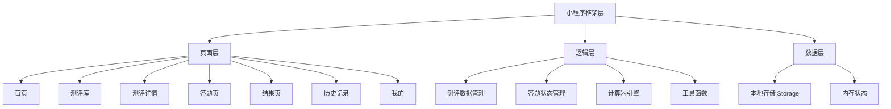

# 心镜 MindMirror 微信小程序 - 技术架构文档

## 1. 架构设计

微信小程序原生开发，纯前端应用，数据本地存储。



---

## 2. 技术选型

| 技术 | 说明 |
|------|------|
| 框架 | 微信小程序原生 (WXML + WXSS + JS) |
| 基础库 | 2.30.0+ |
| 开发工具 | 微信开发者工具 (最新版) |
| 数据存储 | wx.setStorage / wx.getStorage |
| 图表 | 自定义 Canvas 或简单 CSS 图表（免费版） |

**免费版限定**：
- 不使用云开发
- 不使用第三方付费服务
- 所有逻辑前端实现
- 数据本地存储

---

## 3. 页面路由

| 路径 | 页面 | 说明 |
|------|------|------|
| pages/index/index | 首页 | 精选测评、引导、专题 |
| pages/assessments/assessments | 测评库 | 测评列表、搜索、分类 |
| pages/assessment-intro/assessment-intro | 测评详情 | 测评介绍、开始测评 |
| pages/assessment-taking/assessment-taking | 答题页 | 逐题作答 |
| pages/assessment-result/assessment-result | 结果页 | 结果展示 |
| pages/history/history | 历史记录 | 已完成测评列表 |
| pages/mine/mine | 我的 | 用户设置 |

---

## 4. 数据结构

### 4.1 测评数据结构 (Assessment)
```javascript
{
  id: "sbti-personality",
  name: "SBTI人格测试",
  description: "有趣又准的人格测评",
  category: "人格",
  subcategory: "人格类型",
  questions: [
    {
      id: "q1",
      text: "你更倾向于：",
      options: [
        { value: 1, text: "和别人在一起" },
        { value: 5, text: "独自一个人" }
      ]
    }
  ],
  questionCount: 24,
  duration: 5,
  config: {
    dimensionKeys: [],
    dimensionNames: {},
    questionPrefix: "q",
    reverseScored: []
  }
}
```

### 4.2 答题记录 (AnswerRecord)
```javascript
{
  id: "uuid",
  assessmentId: "sbti-personality",
  assessmentName: "SBTI人格测试",
  answers: [
    { questionId: "q1", value: 1 }
  ],
  result: {
    overallScore: 75,
    title: "你的测评结果",
    subtitle: "综合得分 75",
    summary: "...",
    dimensions: [
      { name: "外向性", score: 60, description: "..." }
    ]
  },
  completedAt: 1717234567890
}
```

### 4.3 本地存储结构
```javascript
// key: assessmentRecords
[AnswerRecord, AnswerRecord, ...]

// key: settings
{
  theme: "dark" | "light",
  autoSave: true
}
```

---

## 5. 目录结构

```
miniprogram/
├── pages/                          # 页面目录
│   ├── index/                      # 首页
│   │   ├── index.wxml
│   │   ├── index.wxss
│   │   └── index.js
│   ├── assessments/                # 测评库
│   │   ├── assessments.wxml
│   │   ├── assessments.wxss
│   │   └── assessments.js
│   ├── assessment-intro/           # 测评详情
│   │   ├── assessment-intro.wxml
│   │   ├── assessment-intro.wxss
│   │   └── assessment-intro.js
│   ├── assessment-taking/          # 答题页
│   │   ├── assessment-taking.wxml
│   │   ├── assessment-taking.wxss
│   │   └── assessment-taking.js
│   ├── assessment-result/          # 结果页
│   │   ├── assessment-result.wxml
│   │   ├── assessment-result.wxss
│   │   └── assessment-result.js
│   ├── history/                    # 历史记录
│   │   ├── history.wxml
│   │   ├── history.wxss
│   │   └── history.js
│   └── mine/                       # 我的
│       ├── mine.wxml
│       ├── mine.wxss
│       └── mine.js
├── data/                           # 数据目录
│   ├── assessments/                # 测评数据
│   │   ├── index.js                # 测评列表
│   │   ├── sbti-personality.js
│   │   ├── ocean-bigfive.js
│   │   ├── iq-ravens.js
│   │   └── ... (40+ 测评)
│   └── categories.js               # 分类数据
├── utils/                          # 工具函数
│   ├── storage.js                  # 存储工具
│   ├── calculator.js               # 测评计算器
│   └── format.js                   # 格式化工具
├── components/                     # 自定义组件
│   ├── assessment-card/            # 测评卡片
│   └── progress-bar/               # 进度条
├── app.js                          # 小程序入口
├── app.json                        # 小程序配置
├── app.wxss                        # 全局样式
├── project.config.json             # 项目配置
└── sitemap.json                    # 站点地图
```

---

## 6. 核心功能实现

### 6.1 测评数据管理
- 所有测评数据硬编码在 data/assessments/ 目录
- 按原有仓库的测评数据结构移植
- 支持分类、搜索查找

### 6.2 答题流程
1. 用户点击开始测评 → 进入答题页
2. 逐题作答，答案保存在内存
3. 支持上一题/下一题
4. 完成后调用计算器引擎计算结果
5. 保存到本地存储
6. 跳转到结果页

### 6.3 计算器引擎
- 移植原有仓库的 BaseProfessionalCalculator
- 实现维度计算、得分标准化、结果生成
- 纯前端计算，无后端依赖

### 6.4 数据持久化
- 使用 wx.setStorageSync 同步存储
- 页面加载时读取历史记录
- 结果自动保存，支持随时查看

---

## 7. app.json 配置

```json
{
  "pages": [
    "pages/index/index",
    "pages/assessments/assessments",
    "pages/assessment-intro/assessment-intro",
    "pages/assessment-taking/assessment-taking",
    "pages/assessment-result/assessment-result",
    "pages/history/history",
    "pages/mine/mine"
  ],
  "window": {
    "backgroundTextStyle": "light",
    "navigationBarBackgroundColor": "#0F172A",
    "navigationBarTitleText": "心镜",
    "navigationBarTextStyle": "white",
    "backgroundColor": "#0F172A"
  },
  "tabBar": {
    "color": "#94A3B8",
    "selectedColor": "#8B5CF6",
    "backgroundColor": "#1E293B",
    "borderStyle": "black",
    "list": [
      {
        "pagePath": "pages/index/index",
        "text": "首页",
        "iconPath": "images/tab-home.png",
        "selectedIconPath": "images/tab-home-active.png"
      },
      {
        "pagePath": "pages/assessments/assessments",
        "text": "测评",
        "iconPath": "images/tab-assessment.png",
        "selectedIconPath": "images/tab-assessment-active.png"
      },
      {
        "pagePath": "pages/history/history",
        "text": "历史",
        "iconPath": "images/tab-history.png",
        "selectedIconPath": "images/tab-history-active.png"
      },
      {
        "pagePath": "pages/mine/mine",
        "text": "我的",
        "iconPath": "images/tab-mine.png",
        "selectedIconPath": "images/tab-mine-active.png"
      }
    ]
  },
  "style": "v2",
  "sitemapLocation": "sitemap.json"
}
```
