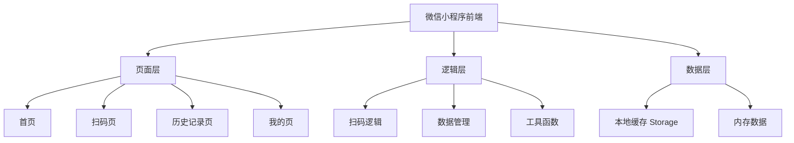
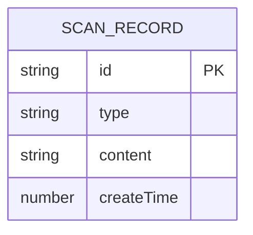

# 扫码仓库微信小程序 - 技术架构文档

## 1. Architecture Design
微信小程序采用原生开发模式，使用微信小程序官方框架，数据本地存储。



## 2. Technology Description
- **框架**：微信小程序原生框架 (WXML + WXSS + JavaScript)
- **开发工具**：微信开发者工具 (最新版本)
- **基础库版本**：2.30.0 及以上
- **扫码能力**：wx.scanCode API
- **数据存储**：wx.setStorageSync / wx.getStorageSync
- **无后端服务**：纯前端应用，数据本地存储

## 3. Page Routes
| 路径 | 页面 | 说明 |
|------|------|------|
| pages/index/index | 首页 | 扫码入口、最近记录 |
| pages/scan/scan | 扫码页 | 扫码功能、结果展示 |
| pages/history/history | 历史记录页 | 历史记录列表、搜索筛选 |
| pages/mine/mine | 我的页 | 用户信息、设置 |

## 4. API Definitions
### 4.1 微信小程序原生 API
- **扫码**：wx.scanCode
- **存储**：wx.setStorageSync / wx.getStorageSync / wx.removeStorageSync
- **剪贴板**：wx.setClipboardData / wx.getClipboardData
- **用户信息**：wx.getUserProfile (按需)
- **振动**：wx.vibrateShort

### 4.2 本地数据结构
```typescript
// 扫码记录类型
interface ScanRecord {
  id: string;
  type: 'qrCode' | 'barCode';  // 二维码或条形码
  content: string;             // 扫码内容
  createTime: number;          // 创建时间戳
}

// 本地存储数据结构
interface LocalStorage {
  scanRecords: ScanRecord[];
  settings: {
    autoSave: boolean;
    vibrate: boolean;
  };
}
```

## 5. Data Model
### 5.1 数据模型定义


### 5.2 数据管理策略
- 扫码记录存储在本地缓存中，key 为 `scanRecords`
- 单条记录最大数量限制为 1000 条
- 超出限制时自动删除最早的记录
- 设置信息独立存储，key 为 `settings`

## 6. 目录结构
```
miniprogram/
├── pages/                  # 页面目录
│   ├── index/              # 首页
│   │   ├── index.wxml
│   │   ├── index.wxss
│   │   └── index.js
│   ├── scan/               # 扫码页
│   │   ├── scan.wxml
│   │   ├── scan.wxss
│   │   └── scan.js
│   ├── history/            # 历史记录页
│   │   ├── history.wxml
│   │   ├── history.wxss
│   │   └── history.js
│   └── mine/               # 我的页
│       ├── mine.wxml
│       ├── mine.wxss
│       └── mine.js
├── utils/                  # 工具函数
│   ├── storage.js          # 存储工具
│   └── format.js           # 格式化工具
├── components/             # 自定义组件
│   └── scan-card/          # 扫码记录卡片
├── images/                 # 图片资源
├── app.js                  # 小程序逻辑
├── app.json                # 小程序配置
├── app.wxss                # 全局样式
└── project.config.json     # 项目配置
```

## 7. 核心功能实现要点

### 7.1 扫码功能
- 使用 wx.scanCode API，支持二维码和条形码
- 扫码成功后震动反馈
- 自动保存到历史记录

### 7.2 历史记录管理
- 按时间倒序排列
- 支持左滑删除
- 支持搜索和筛选
- 批量删除功能

### 7.3 数据持久化
- 使用 wx.setStorageSync 同步存储
- 页面加载时从 storage 读取数据
- 数据变更时立即保存

### 7.4 性能优化
- 列表使用虚拟滚动（大数据量时）
- 图片懒加载
- 避免频繁的 storage 读写
